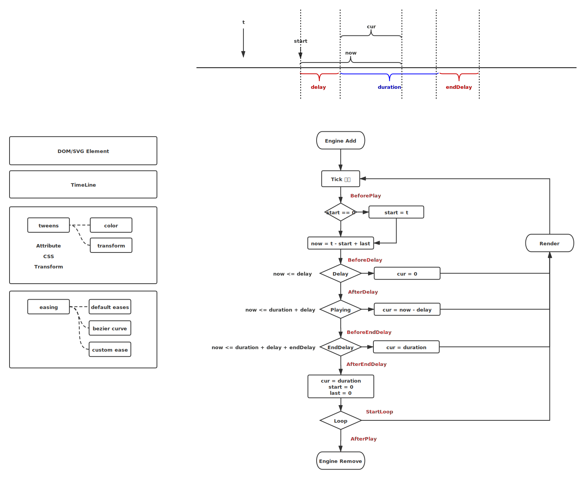

# Dom-Animate


## 框架定位:

轻量级DOM & SVG 动画引擎


命令式？？
声明式？？
面向对象？？


属性类型：
* attribute
* css
* transform
* text

值类型：
* 数值
* 颜色
* transform值

值转化：
type:'',
prop:'',
from: {numbers,strings},
to:{numbers,strings},




## 设计接口: 调用方式，参数，方法

```
new Animate(options)
```

·

```
const move = Animate(
    {
        el: '',
        props:{
            x
        },
        duration: 5000, // 时长
        loop: true,  // 是否循环
        direction: 'alternate',     // 方向，是否逆向
        easing: 'easeInOutCirc',    // 缓动    
    }
)
```


### Target 目标元素


### Attrs 动画属性


### Options 动画设置

| 参数      | 类型               |     |
| --------- | ------------------ | --- |
| duration  | Number             |     |
| loop      | Boolean            |     |
| direction | String             |     |
| easing    | String \| Function |     |
| auto      | Boolean            |     |
| begin     | Function           |     |
| complete  | Function           |     |
|           |                    |     |
|           |                    |     |


### Methods 方法


| 方法     |     | --- |
| -------- | --- | --- |
| play     |     |     |
| pause    |     |     |
| reset    |     |     |
| complete |     |     |
| process  |     |     |


## 架构设计: 工程(webpack)，测试(jest)，TS


## 程序实现

设计模式（类，通信方式，策略模式）, 模块设计（循环引擎，缓动模块，参数预处理，动画数据，动画主类）


渲染引擎 engine.js

缓动模块 easing.js
    Coding: https://github.com/danro/jquery-easing/blob/master/jquery.easing.js
    Demo：https://easings.net/


数据模块 data.js（颜色，百分比，数值，角度）

动画主类 main.js


