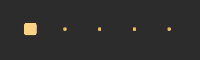
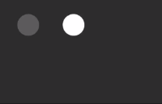
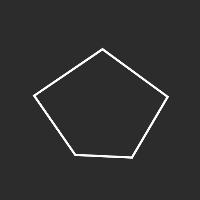
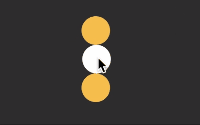

<ClientOnly>
  <Totalizer/>
</ClientOnly>

::: danger
当前版本正处于测试阶段，正式版本即将发布。
:::

## Introduction

Totalizer JS 提供一种简单的DOM、SVG动画描述方式，以及一个管理多个动画描述的机制。它的诞生初衷是提供一个核心的动画渲染和管理的抽象层，以便构建复杂动画交互组件。

什么时候使用 Totalizer JS？

* 制作简单的补间动画，关键帧动画等。
* 作为构建复杂动画组件的核心部分。例如，视差滚动，路径绘制，交错动画等。


## Installation

``` shell
npm i -S totalizer
```

## Usage

引入

``` javascript
import Totalizer from 'totalizer';
```

创建一个动画实例

``` javascript
conat animation = new Totalizer();
```

添加一个动画描述

``` javascript
animation.add({
  el: document.getElementById("div"),   // 动画节点
  props: {
    translateX: [0, 200],       // 偏移量从 0px 变为 200px
    background: ["#333", "#fff"],       // 背景色从 #333 变为 #fff 
  },
  duration: 1000,                       // 动画持续时间
  delay: 200,                           // 动画延时
  easing: 'easeOutBounce',              // 缓动效果
})
```

控制动画实例

``` javascript
// 循环播放
animation.loop().play();
```

## Features


Totalizer（累加器），顾名思义，可以通过添加多个动画描述，来实现复杂的动画。例如：

* [交错动画](https://totalizer-js.github.io/document/Staggering.html)：添加多个不同元素的动画描述，来实现同步或交错动画。




* [连续动画](https://totalizer-js.github.io/document/Continuous.html)：添加一个元素多个不同时间段的动画描述，来实现连续动画。




* [SVG动画](https://totalizer-js.github.io/document/SVG.html)：通过自定属性变化函数，来实现SVG动画特殊效果。





* [视差动画](https://totalizer-js.github.io/document/Parallax.html)：通过设定动画的进程来实现视差效果。



## Documents

[totalizer-js.github.io](//totalizer-js.github.io)

## License

MIT
